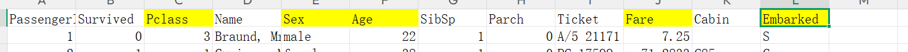
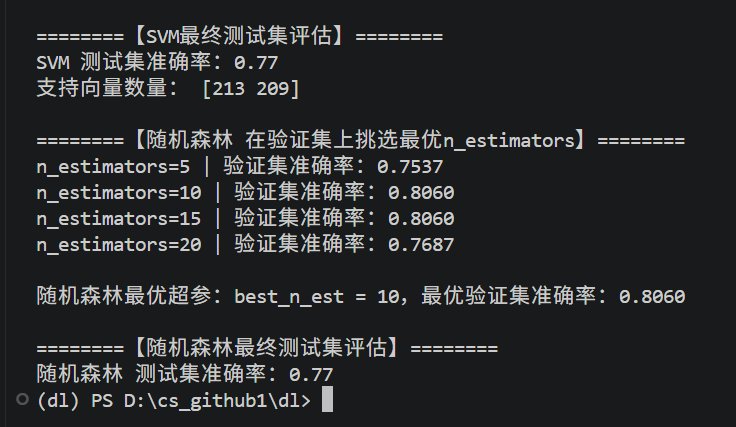
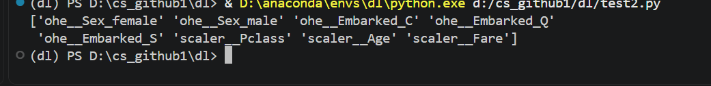
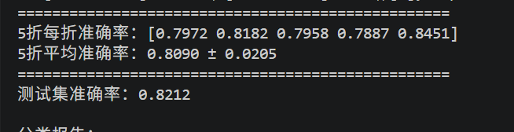

# 特征选取与数据清理
## 特征选取

就你们了吧（此时我根本没有意识到有些加起来可以建新特征，我说给这么多没啥用的信息干嘛直接删）
## 数据清理
1. 首先要删掉无关列，然后其他数据缺失或异常要检查一遍

2. 根据统计发现年龄有大量缺失，于是选择均值填充；还有两列只有1，2个所以直接kill吧
3. 原本先处理数据是因为想偷懒，分开后我就要处理多次，but填充时想起来不可以用训练集的均值填充测试集的空白，也不可以用所有数据的均值填充，所以**必须先将测试集和训练集分开**，分别进行处理，所以我的数据处理顺序应该先分集再填充和删减，想好再打啊

# 数据预处理2
1. 于是进行分集，突然我想起来之前好像了解过数据少时可以进行k折循环验证，于是我打算两个都尝试一下以比较是不是真的有区别....
2. 但是这又引申出一个问题，我的k折循环内部不是也有训练集和验证集吗？？？我前面的数据集根本就不可以这样简单填充吧，应该在k折内部每一折的测试集和训练集的均值都用训练集的填充，选出最优超参数之后再整个又重新填吗什么鬼。。。。。此时我已经后悔用这个k折,but写都写了
后续：确实有区别

>这个训练的代码是我让ai参照我的写的普通分三个集的版本
## 独热编码
接下来进行独热编码

我要验分类，分类没有问题

# k折循环
1. 好的，因为之前对k折的了解比较浅薄，我才意识到，我还要在里面再写一个随机森林，我真是没事找事干
# 随机森林
1. 选这个是因为之前了解过一点并且题目里提到了哈哈
2. 训练完我又突然想起来是不是树模型比较容易过拟合，于是去学习了一下怎么解决这个问题，加入正则化的参数后准确率提升了0.01，也可能是巧合吧....

# 总结

# 反思
经过我不断折腾，从向量机换到随机森林，然后又从K折交叉验证换成普通的三个数据集划分，发现变化一点都不大，于是我上网查询了资料，原来提升的关键在特征工程，所以我第一步就输了呢。。。
了解到可以增加新的特征比如说票价除以家庭人数的单人票价
我说为啥有人票价为零呢我还以为这个票价是每个人的单独的票价还以为有些人可以免票做呢
另外一个特征可以构建的就是家庭人数子女和父母加在一起一般人多的话存活概率要大一些
此外还听说了其他模型比如说叫什么xgboot吗但我不是很了解
构建新的特征后整体准确率还可以得到提升，emm为啥也还是没有提升多少
